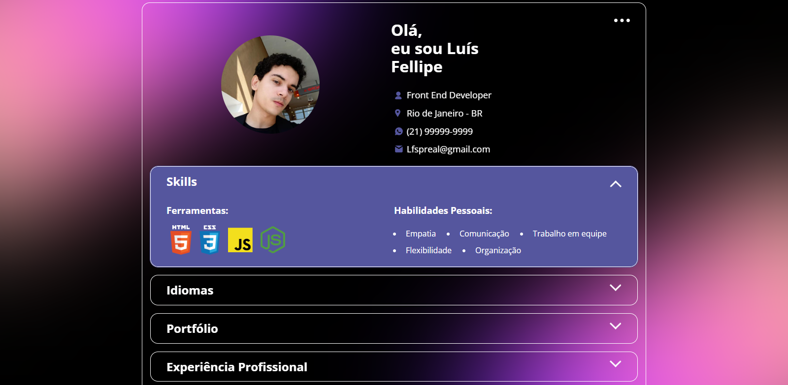

# Portfólio - Luís Fellipe 💼

## 👨‍💻 Sobre o Projeto

Este é o meu portfólio pessoal como desenvolvedor front-end. Nele apresento algumas das minhas principais habilidades, ferramentas que domino, idiomas que falo, experiências profissionais e alguns dos projetos que desenvolvi.

A estrutura do site é construída com HTML, CSS e JavaScript, e os dados são carregados dinamicamente a partir de um arquivo `.json`. A interface possui um layout responsivo e utiliza acordeons personalizados para organizar o conteúdo de forma clara e interativa.

---

## 📸 Prévia

  
> *Interface desktop do portfólio com a seção "Skills" aberta.*

---

## 🌐 Acesse Online

Você pode visualizar o portfólio diretamente pelo GitHub Pages:  
🔗 [luis-fellipe.github.io/Portfolio](https://luis-fellipe.github.io/Portfolio/)

---

## 🚀 Tecnologias Utilizadas

- **HTML5**
- **CSS3**
  - Flexbox & Grid
  - Responsividade
  - Animações com `hover` e `transition`
- **JavaScript (ES6+)**
  - Manipulação de DOM
  - Fetch API para carregamento dinâmico de dados
- **Normalize.css**
- Ícones SVG customizados
- Estrutura modularizada (CSS/JS separados)

---

## 🧠 Funcionalidades

- Acordeons personalizados para navegação entre seções
- Conteúdo dinâmico carregado via `fetch()` de um JSON externo
- Seções:
  - Informações pessoais
  - Skills (ferramentas e soft skills)
  - Idiomas
  - Projetos do portfólio com links
  - Experiências profissionais
- Layout responsivo
- Imagens e ícones otimizados

---

## 🔗 Contato

- [LinkedIn](https://www.linkedin.com/in/luis-fellipe-real)
- Email: Lfspreal@gmail.com
